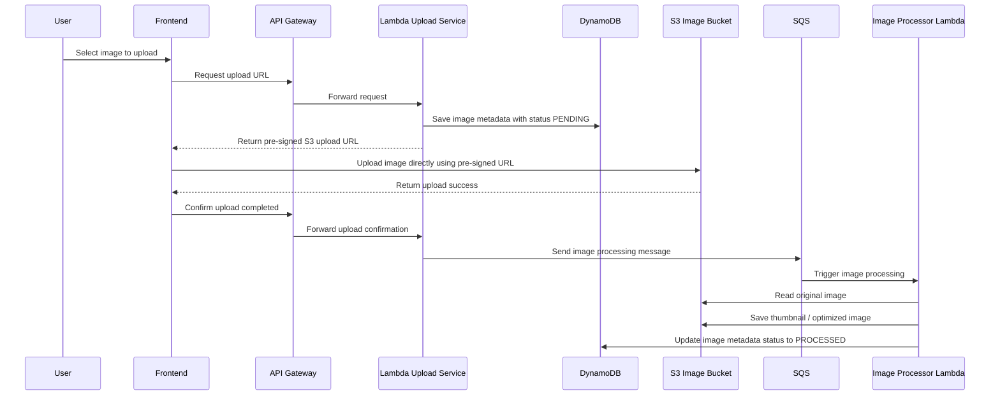
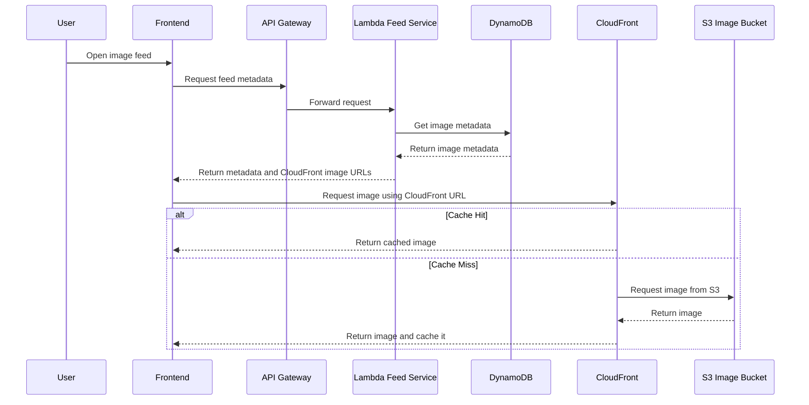

# architect-image-sharing-platform
Architecture case study for a scalable image-sharing platform optimized for global delivery, cost efficiency, and automatic scaling.


# Architectural Reasoning

Functional Requirements
Users can upload images
Users can browse and view images
Non-Functional Requirements
Support 10,000 daily users initially
Scale up to 500,000 daily users
Highly available
Fast image loading worldwide
Cost-effective
Automatically scalable
Problem Statement

The application is expected to have significantly more image views than uploads.

Example:

1 image upload
↓
Thousands of image views

As the number of users grows, the architecture must be able to handle high read traffic without creating unnecessary load on the backend.

The solution should also provide a good user experience for users located in different regions while keeping infrastructure costs reasonable.

Main Goal

Design a scalable and cost-effective image sharing platform that:

Supports future growth
Delivers images quickly to global users
Minimizes backend workload
Automatically scales based on demand
Keeps operational overhead low
Maintains a responsive user experience

## Why Lambda Instead of Containers

Lambda was selected because the backend APIs are lightweight and event-driven.

The system mainly needs to:

* Generate pre-signed upload URLs
* Save image metadata
* Retrieve image metadata
* Send image processing messages to SQS

These tasks are short-running and do not require a server running 24/7.

### Why Not Containers

Containers are a good option for long-running services, heavy workloads, or applications that need full control over runtime and networking.

For this use case, containers are not required because:

* The workload is not long-running
* Traffic may vary throughout the day
* Running containers 24/7 adds baseline cost
* Additional infrastructure such as ECS/Fargate, task definitions, scaling policies, and load balancers may be required
* Operational overhead is higher compared to Lambda

Lambda provides enough scalability with lower cost and less infrastructure management.

---

## Why DynamoDB Instead of SQL

DynamoDB was selected because the current access patterns are simple and predictable.

The application mainly needs to:

* Save image metadata
* Get image metadata by ID
* List latest images
* Get images uploaded by a user

These access patterns do not require complex joins or relational queries.

### Why Not SQL

SQL databases are useful when the system requires:

* Complex relationships
* Joins across multiple entities
* Reporting workloads
* Advanced filtering
* Transaction-heavy operations

For this use case, those requirements are not needed.

Using SQL at this stage may introduce additional operational overhead such as:

* Connection pooling
* Database scaling
* Read replicas
* Index management
* Server maintenance

DynamoDB is a better fit for simple metadata access at scale while keeping the architecture lightweight.

---

## Why CloudFront Directly Accesses S3

Images are expected to be viewed more frequently than they are uploaded.

The backend is responsible only for returning metadata and image URLs.

```text
Frontend
 -> API Gateway
 -> Lambda
 -> DynamoDB
 -> Return image metadata and CloudFront URLs
```

The actual image should be loaded directly through CloudFront.

```text
Browser
 -> CloudFront
 -> S3
```

### Why Not Serve Images Through Backend

Serving images through the backend is not ideal because:

* Every image request consumes API Gateway and Lambda resources
* Backend cost increases as image traffic grows
* Additional latency is introduced
* Lambda becomes responsible for file delivery
* CDN caching benefits are reduced

CloudFront is a better solution because it caches images in edge locations closer to users, reducing latency and backend workload.

---

## Why SQS and Image Processor

Image processing should not be part of the main application flow.

Processing tasks include:

* Thumbnail generation
* Image compression
* Image optimization

### Without SQS

```text
Upload Image
 -> Process Image
 -> Return Response
```

The user must wait until image processing is completed.

### With SQS

```text
Upload Image
 -> Send Message To SQS
 -> Return Response

SQS
 -> Image Processor
 -> Process Image In Background
```

The upload completes immediately while image processing happens asynchronously.

### Why Not Process Immediately

Processing images during upload is not ideal because:

* Upload response becomes slower
* Backend is blocked by image processing
* Failures can impact the user experience
* Processing cannot scale independently from the upload service

SQS separates background processing from the main application flow.

This keeps the upload experience fast while allowing image processing workloads to scale independently.


# Sequence Diagram

## 1. Image Upload Flow



---

## 2. Image Browse Flow



---


