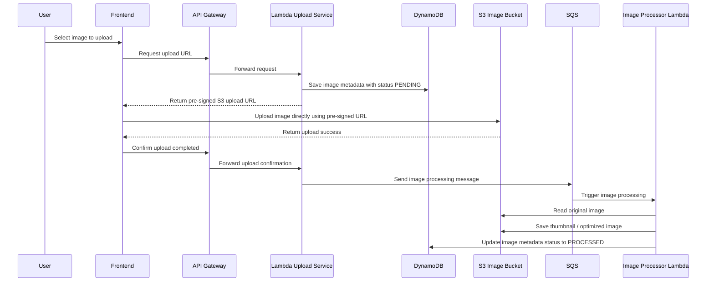
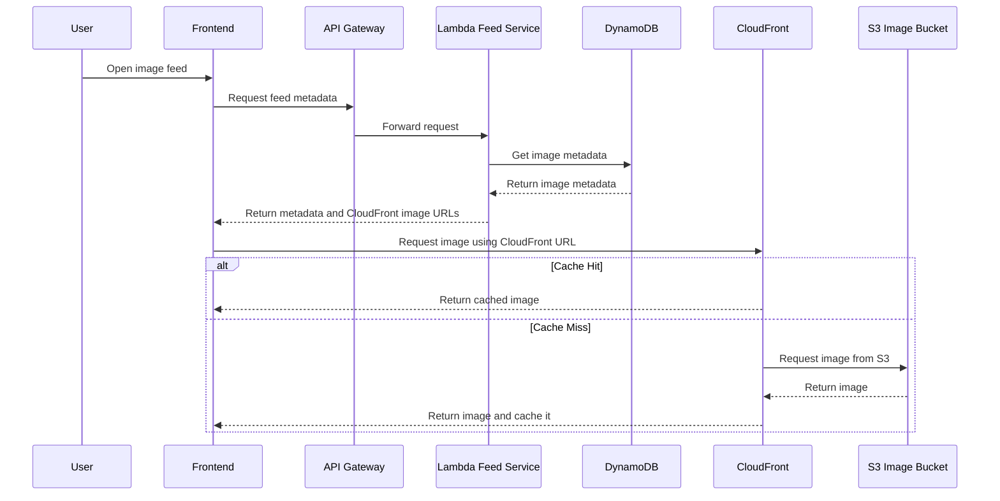

# architect-image-sharing-platform
Architecture case study for a scalable image-sharing platform optimized for global delivery, cost efficiency, and automatic scaling.


# Architectural Reasoning

## Requirements

### Functional Requirements

* Users can upload images
* Users can browse and view images

### Non-Functional Requirements

* Support 10,000 daily users initially
* Scale up to 500,000 daily users
* Highly available
* Fast image loading worldwide
* Cost-effective
* Automatically scalable

---


## Main Challenge

The application is expected to have more image views than uploads.

Example:

```text
1 image uploaded
↓
Thousands of users view the same image
```

The architecture should be optimized for image delivery, scalability, and cost.

---

## Why S3

S3 is used to store image files.

Reasons:

* Built for file storage
* Highly scalable
* Cost-effective
* No storage server management required

---

## Why CloudFront

Users are located in different countries.

Without CloudFront:

```text
User
 ↓
S3
```

Every image request goes directly to S3.

With CloudFront:

```text
User
 ↓
CloudFront
 ↓
S3
```

CloudFront stores cached copies of images in edge locations closer to users.

Benefits:

* Faster image loading
* Lower latency
* Reduced requests to S3
* Better experience for global users

---

## Why CloudFront Directly Accesses S3

The backend only returns image information and image URLs.

Example:

```json
{
  "id": 123,
  "imageUrl": "https://cdn.myapp.com/images/123.jpg"
}
```

The browser downloads the image directly from CloudFront.

Benefits:

* Image traffic does not hit the backend
* Lower Lambda and API Gateway usage
* Better scalability
* Lower operating cost

---

## Why Pre-Signed URLs

The frontend uploads images directly to S3.

Flow:

```text
Frontend
 ↓
Request Upload URL
 ↓
Upload Directly To S3
```

Benefits:

* Faster uploads
* Lower backend traffic
* Reduced compute cost
* Better scalability

---

## Why Lambda

The API mainly handles:

* Generate upload URLs
* Save image metadata
* Retrieve image metadata

Reasons:

* Automatically scales
* No server management
* Pay only when used
* Good fit for variable traffic

Cold starts are acceptable because this application does not require real-time responses.

---

## Why DynamoDB

The current requirements are simple.

Examples:

```text
Get image by ID

Get latest images

Get images by user
```

Reasons:

* Fast read and write performance
* Automatically scales
* No database server management
* Low operational overhead

A relational database is not required because there are no requirements for complex joins, reporting, or transactions.

---

## Why SQS and Image Processor

Image processing tasks such as:

* Thumbnail generation
* Image optimization
* Compression

should not be part of the main application flow.

Without a queue:

```text
Upload Image
 ↓
Process Image
 ↓
Return Response
```

Users need to wait until processing is completed.

With SQS:

```text
Upload Image
 ↓
SQS
 ↓
Image Processor
```

The upload is completed immediately while image processing happens in the background.

Benefits:

* Faster user experience
* Upload service stays responsive
* Easier to scale processing independently
* Better fault tolerance
* Prevents heavy processing from affecting the main application

---

## Summary

This architecture is designed to handle:

* High image traffic
* Global users
* Future growth
* Cost optimization
* Automatic scaling

Key services:

* S3 for image storage
* CloudFront for image delivery
* Lambda for APIs
* DynamoDB for metadata
* SQS for asynchronous processing
* Image Processor for thumbnail generation and optimization

# Sequence Diagram

## 1. Image Upload Flow



---

## 2. Image Browse Flow



---

## 3. Upload Flow Summary

```text
User selects image
 -> Frontend requests pre-signed URL
 -> Upload Service saves metadata as PENDING
 -> Upload Service returns pre-signed URL
 -> Frontend uploads image directly to S3
 -> Frontend confirms upload completed
 -> Upload Service sends message to SQS
 -> Image Processor reads from SQS
 -> Image Processor gets original image from S3
 -> Image Processor creates thumbnail / optimized image
 -> Image Processor updates metadata as PROCESSED
```

---

## 4. Browse Flow Summary

```text
User opens feed
 -> Frontend requests feed metadata
 -> Feed Service reads metadata from DynamoDB
 -> Feed Service returns image URLs
 -> Browser loads images from CloudFront
 -> CloudFront serves cached image if available
 -> If not cached, CloudFront gets image from S3
```

